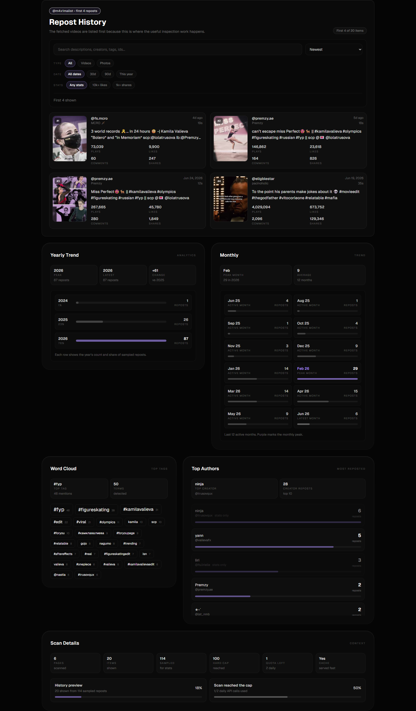

# NyxRepost

NyxRepost is a TikTok repost analytics dashboard built with React, Vite, Tailwind CSS, and an Express proxy server. It turns a TikTok username into a readable inspection view with repost history, thumbnails, creator metadata, engagement metrics, trend summaries, tags, and an embedded video preview.

The main goal is simple: make repost activity easier to review without digging through raw API output.



## Table of Contents

- [Features](#features)
- [How It Works](#how-it-works)
- [Tech Stack](#tech-stack)
- [Project Structure](#project-structure)
- [Getting Started](#getting-started)
- [Available Scripts](#available-scripts)
- [API Routes](#api-routes)
- [Data Reliability](#data-reliability)
- [Production Notes](#production-notes)
- [Deploying to Vercel](#deploying-to-vercel)
- [Troubleshooting](#troubleshooting)

## Features

### Repost History

- Two-column video history for fast scanning.
- TikTok thumbnail support through the local thumbnail proxy.
- Creator name, handle, caption, date, duration, and engagement metrics.
- Search across captions, creators, tags, and video IDs.
- Sort by newest, oldest, views, likes, shares, comments, or duration.
- Filter by media type, date range, and engagement thresholds.
- Clickable tags and authors for quick narrowing.

### Video Preview

- In-app TikTok embedded player.
- Only one player is loaded at a time.
- Scroll, swipe, arrow keys, or the Previous/Next buttons to move through videos.
- External TikTok link remains available as a fallback.

### Analytics

- Yearly repost distribution.
- Monthly activity summary.
- Top tags and keyword frequency.
- Top authors by repost count.
- Scan details, cache status, quota details when available, and raw JSON for debugging.

### Backend Proxy

- Proxies repost API requests from the frontend.
- Caches repost API responses for one hour.
- Proxies TikTok/ByteDance thumbnail images.
- Converts HEIC thumbnails to JPEG when needed.
- Serves the production frontend build from the Express server.

## How It Works

```text
Browser
  -> React/Vite frontend
  -> Express proxy server
  -> Upstream repost API
  -> Normalized dashboard view
```

The frontend asks the local server for repost data. The server fetches the upstream API response, caches it, and returns the result to the client. The dashboard then normalizes the response shape and renders the repost history, charts, tags, authors, and debug data.

Thumbnail URLs are routed through `/api/thumbnail` so the app can display TikTok CDN images consistently and handle HEIC images.

## Tech Stack

| Layer | Technology |
| --- | --- |
| Frontend | React 19, Vite, Tailwind CSS |
| Backend | Node.js, Express |
| Media | TikTok embed player, thumbnail proxy, HEIC conversion |
| Tooling | oxlint, concurrently |

## Project Structure

```text
.
├── client/
│   ├── src/
│   │   ├── components/       React UI components
│   │   ├── hooks/            Shared frontend hooks
│   │   ├── App.jsx           Fetch flow and dashboard wiring
│   │   └── index.css         Tailwind theme and global styles
│   ├── public/               Static frontend assets
│   └── package.json
├── server/
│   ├── index.js              Express proxy and static server
│   └── package.json
├── docs/
│   └── nyxrepost-dashboard.png
├── package.json              Root scripts for setup/dev/build
└── readme.md
```

## Getting Started

### Requirements

- Node.js 20 or newer recommended.
- npm.
- Network access to the upstream repost API and TikTok media hosts.

### Install

```bash
npm run setup
```

This installs dependencies for both `client/` and `server/`.

### Run Locally

```bash
npm run dev
```

The frontend runs at:

```text
http://localhost:5173
```

The backend runs at:

```text
http://localhost:3001
```

### Build

```bash
npm run build
```

This builds the frontend into `client/dist`.

### Serve Production Build

```bash
npm start
```

The Express server serves the built frontend and API routes from the same process.

## Vercel Support

This repository includes a `vercel.json` configuration and serverless functions under `api/`.

On Vercel:

- `client/` is built with Vite.
- `client/dist` is served as the static frontend.
- `/api/reposts/:username` is handled by `api/reposts/[username].js`.
- `/api/thumbnail` is handled by `api/thumbnail.js`.
- Non-API routes fall back to `index.html` for the React app.

The local Express server is still useful for development and self-hosted deployments, but Vercel uses the serverless API functions instead.

## Available Scripts

Root scripts:

| Command | Description |
| --- | --- |
| `npm run setup` | Install client and server dependencies. |
| `npm run dev` | Run the frontend and backend together. |
| `npm run build` | Build the frontend for production. |
| `npm start` | Start the Express server. |

Client scripts:

| Command | Description |
| --- | --- |
| `npm run dev` | Start the Vite development server. |
| `npm run build` | Build the React frontend. |
| `npm run lint` | Run oxlint. |
| `npm run preview` | Preview the production build locally. |

Server scripts:

| Command | Description |
| --- | --- |
| `npm start` | Start the server normally. |
| `npm run dev` | Start the server with Node watch mode. |

## API Routes

### `GET /api/reposts/:username`

Fetches repost data for a TikTok username.

Example:

```text
GET /api/reposts/m4x1malist
```

Behavior:

- Removes a leading `@` from the username.
- Lowercases the username for cache keys.
- Requests the upstream repost API with `all=1`.
- Caches successful responses for one hour in `server/.api-cache.json`.
- Returns cached responses with `cached: true` and `fromCache: true`.

### `GET /api/thumbnail?url=...`

Fetches and returns a thumbnail image from an allowed TikTok/ByteDance media host.

Behavior:

- Accepts only `http` and `https` URLs.
- Allows TikTok CDN and ByteDance image hosts.
- Caches thumbnails in memory for six hours.
- Converts HEIC images to JPEG.
- Sets browser cache headers for returned images.

## Data Reliability

NyxRepost displays the data returned by the upstream repost API. Some TikTok repost and media signals are not perfectly reliable from public or third-party endpoints. In practice, the response can sometimes include videos that look like favorites, saved videos, or other media candidates instead of confirmed reposts.

For that reason, treat the returned media as repost candidates when the API output looks inconsistent. The app keeps the workflow transparent by showing scan details and raw JSON alongside the dashboard.

## Production Notes

- Set `PORT` to control the Express server port.
- Run `npm run build` before `npm start` when serving the production frontend.
- Keep `server/.api-cache.json` out of source control. It contains cached API responses.
- Keep `node_modules/` and build outputs out of source control.
- If deploying behind a platform proxy, make sure routes under `/api/*` reach the Express server.

## Deploying to Vercel

The project is ready to deploy from the repository root.

Expected Vercel settings:

| Setting | Value |
| --- | --- |
| Install Command | `npm install && cd client && npm install` |
| Build Command | `cd client && npm run build` |
| Output Directory | `client/dist` |

The same values are already defined in `vercel.json`, so manual configuration is usually not needed.

## Troubleshooting

### The dashboard loads but no reposts appear

- Confirm the username is public and typed correctly.
- Check the raw JSON panel for the actual API response.
- Try again after the cache expires if the upstream API returned incomplete data.

### Thumbnails do not load

- Confirm the thumbnail URL host is allowed by the server.
- Some TikTok media URLs expire. Refetching the username can refresh the media URLs.
- HEIC thumbnails are converted server-side, but conversion can fail if the upstream image is invalid.

### TikTok preview does not play

- The app uses TikTok's embedded player.
- Some videos can still require TikTok permissions, regional access, or login.
- Use the "Open on TikTok" button as a fallback.

### Upstream API errors

- The proxy returns upstream status codes when possible.
- Non-JSON upstream responses are returned as `502` with a short raw preview.
- Rate limits or API changes can temporarily break fetching.

## License

No license has been specified yet.
